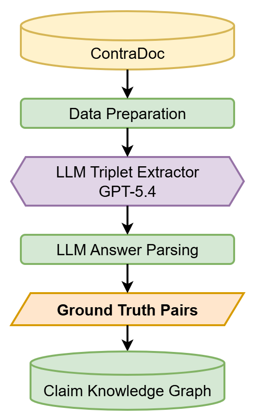
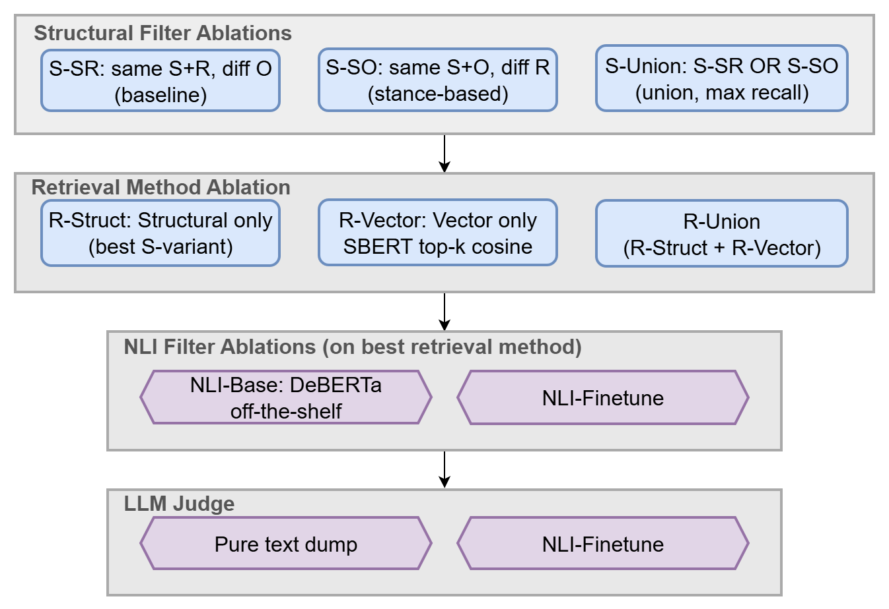

# Claim Contradiction Detection over Knowledge Graphs

> **Status: Progress Report.** The current pipeline (KG ingestion, structural / vector retrieval, off-the-shelf NLI, LLM judge, end-to-end baseline comparison) is end-to-end complete on a 100-document subset. **NLI-Finetune is not yet implemented**; current pipeline numbers use the off-the-shelf `cross-encoder/nli-deberta-v3-base` (NLI-Base). Next steps before the final presentation are listed at the bottom.

## Overview

Detect **self-contradictions inside a single document** by routing each document through a chunk-aware knowledge graph, structural / vector retrieval, an NLI filter, and an LLM judge - rather than dumping the whole document into an LLM in one shot.

The hypothesis: a structured retrieval stage surfaces long-range contradictory sentence pairs that a single full-document LLM call easily glosses over, and an NLI re-ranker keeps LLM workload bounded by filtering trivially-non-contradictory candidates upstream.

## Research Questions

- **RQ1 (Structural Filter)**: Among S-SR (same subject + predicate, differing object), S-SO (same subject + object, differing predicate), and S-Union over a chunk-first KG, which gives the best precision-recall tradeoff for surfacing candidate contradictory chunk pairs?
- **RQ2 (Retrieval Method)**: Does combining structural and vector retrieval (R-Union) improve gold-pair coverage over R-Struct or R-Vector alone?
- **RQ3 (NLI Filter)**: How effectively does an off-the-shelf NLI cross-encoder (NLI-Base) reduce the retrieval candidate pool while preserving gold contradictions, and does the planned in-domain fine-tuning of DeBERTa-v3-base on ContraDoc-derived pair labels (binary contradiction-vs-not head; NLI-Finetune) outperform the off-the-shelf 3-class model?
- **RQ4 (Pipeline vs Baseline)**: Does the full pipeline (KG + retrieval + NLI + LLM judge) beat a direct full-document text-dump LLM baseline on self-contradiction recall and F1?

## Architecture

### Ingestion Pipeline



Each ContraDoc document is split into sentence-level chunks, sent to GPT-5.4 for per-sentence triple extraction with `is_evidence` / `ref_index` tags, and inserted into Neo4j under a **chunk-first GraphRAG schema**:

- `:Document` -[`:CONTAINS`]-> `:Chunk` -[`:MENTIONS`]-> `:Entity`
- `:Chunk` carries `{sentence_id, source_text, embedding}` (SBERT all-MiniLM-L6-v2, 384-dim)
- `:Entity` -[`:RELATION {predicate, doc_id, sentence_id, ...}`]-> `:Entity`
- `:Entity` nodes are scoped by `(doc_id, name)` uniqueness, so the graph is partitioned into 100 disjoint per-document subgraphs.

Gold-evidence and gold-ref annotations from ContraDoc propagate to the `:Chunk` nodes, so retrieval can be evaluated directly against per-document ground-truth pairs.

### Ablation Pipeline



Four-stage controlled ablation:

| Stage | Notebook | Variants |
|---|---|---|
| Structural Filter | 04 | S-SR, S-SO, S-Union |
| Retrieval Method | 05 | R-Struct, R-Vector @ K ∈ {1, 3, 5, 10, 20}, R-Union |
| NLI Filter | 06 | **NLI-Base** (DeBERTa-v3, off-the-shelf); NLI-Finetune *[planned]* |
| LLM Judge | 07 / 08 | Pipeline (KG -> NLI -> LLM) vs Baseline (full-doc text dump -> LLM) |

## Notebooks

| # | Notebook | Purpose |
|---|---|---|
| 00 | `00_load_ContraDoc.ipynb` | Load + sample 50 YES / 50 NO docs from ContraDoc |
| 02 | `02_triples_extraction_ContraDoc.ipynb` | Per-sentence triple extraction with evidence/ref tags |
| 03 | `03_insert_to_neo4j_ContraDoc.ipynb` | Insert chunk-first GraphRAG schema; build vector index |
| 04 | `04_structural_filtering_ContraDoc.ipynb` | S-SR / S-SO / S-Union over `:RELATION` edges, aggregated to chunk pairs |
| 05 | `05_vector_similarity_ContraDoc.ipynb` | Per-doc top-K vector retrieval over `:Chunk` embeddings |
| 06 | `06_NLI_ContraDoc.ipynb` | Score candidate chunk pairs with NLI-Base |
| 07 | `07_LLM_ContraDoc.ipynb` | LLM final judgment on NLI-passed pairs (ContraDoc 8-type taxonomy) |
| 08 | `08_baseline_LLM_ContraDoc.ipynb` | Text-dump baseline + side-by-side end-to-end comparison |

## Dataset

- **ContraDoc** (Li et al., 2024): 891 documents from Wikipedia, story, and news domains, each labeled YES (contains a self-contradiction with annotated evidence/ref sentences and a contradiction type) or NO.
- **Working subset for this progress report**: 50 YES + 50 NO documents (= 100 total), sampled deterministically.
- Per-document ground truth: `(gold_evidence_sentence_id, gold_ref_sentence_ids[], contra_type)` where `contra_type` is one of 8 ContraDoc types (Negation, Numeric, Content, Perspective/View/Opinion, Emotion/Mood/Feeling, Relation, Factual, Causal) or pipe-separated multi-label.

### Two gold-pair denominators

| Set | Count | Used by |
|---|---:|---|
| All gold pairs | **37** across 36 docs | Steps 04, 05, 06, 07 (KG-internal eval) |
| Cross-chunk only | **31** across 31 docs | Step 08 (pipeline vs baseline) |

The 6-pair difference: cases where ContraDoc's annotated `evidence_sentence_id == ref_sentence_id` (same sentence plays both roles) - unreachable by any cross-chunk retrieval method, so excluded from the baseline comparison for fairness. Separately, 14 of the 50 YES docs lost gold tagging due to LLM extraction failures that the fuzzy fallback could not recover.

## Tech Stack

| Component | Technology |
|---|---|
| Knowledge Graph | Neo4j 5 (Docker) + APOC + Vector Index |
| Triple Extraction | GPT-5.4 via `langchain-openai` structured output (Pydantic) |
| Sentence Embeddings | sentence-transformers `all-MiniLM-L6-v2` (384-dim) |
| NLI Model (current) | `cross-encoder/nli-deberta-v3-base` (off-the-shelf) |
| LLM Judge | GPT-5.4 (configurable via `settings.llm_model`) |
| Config | `pydantic-settings` + `.env` |
| Logging | `loguru` |
| Package Manager | `uv` |

## Results

All numbers below are on the 50 YES + 50 NO subset. Defaults: `Vector K = 20`, `NLI_THRESHOLD = 0.5`, LLM `temperature = 0`.

### End-to-End Funnel (vs 37 gold chunk pairs)

| Stage | Surviving gold | Pair-Recall | Doc-Recall | Candidate count |
|---|---:|---:|---:|---:|
| S-Union (structural only) | 16 / 37 | 43.2% | 16 / 36 = 44.4% | 565 |
| Vector@20 ∪ S-Union | 23 / 37 | 62.2% | 23 / 36 = 63.9% | 2,451 |
| + NLI-Base ≥ 0.5 | 22 / 37 | 59.5% | 22 / 36 = 61.1% | 581 |
| + LLM positive | 18 / 37 | 48.6% | 18 / 36 = 50.0% | 149 |

**Retrieval is the dominant loss**: 14 of 37 gold pairs never enter the candidate pool. NLI-Base is essentially pass-through (22 of 23 retained even at threshold 0.95) and contributes little discriminative power. This is the primary motivation for the planned **NLI-Finetune**.

### RQ1 - Structural Filter (Step 04)

| Variant | #Cand | Caught | Pair-R | Doc-R | Precision |
|---|---:|---:|---:|---:|---:|
| S-SR | 459 | 12 | 12/37 = 32.4% | 12/36 = 33.3% | 2.6% |
| S-SO | 109 | 4 | 4/37 = 10.8% | 4/36 = 11.1% | 3.7% |
| **S-Union** | **565** | **16** | **16/37 = 43.2%** | **16/36 = 44.4%** | **2.8%** |

S-Union dominates on recall; S-SO has slightly higher precision but recall is too low to use alone.

### RQ2 - Retrieval Method (Step 05)

| Variant | #Cand | Pair-R | Doc-R | Precision |
|---|---:|---:|---:|---:|
| R-Struct (S-Union) | 565 | 43.2% | 44.4% | 2.8% |
| R-Vector @ 1 | 100 | 35.1% | 36.1% | 13.0% |
| R-Vector @ 5 | 500 | 45.9% | 47.2% | 3.4% |
| R-Vector @ 10 | 1,000 | 54.1% | 55.6% | 2.0% |
| R-Vector @ 20 | 2,000 | 62.2% | 63.9% | 1.1% |
| **R-Union @ 20** | **2,451** | **62.2%** | **63.9%** | **0.9%** |

R-Vector @ K = 1 is the most precise per-pair (13.0%) but caps at 35% recall. R-Union @ 20 is selected as the operating point: highest recall, structural pairs come "for free" since they often overlap with vector top-K.

### RQ3 - NLI Filter (Step 06)

| Threshold | #Passed | Reduction | TP | Pair-R (vs 23 retrieved) | Pair-R (vs 37 total) |
|---:|---:|---:|---:|---:|---:|
| 0.30 | 612 | 75.0% | 22 | 22/23 = 95.7% | 22/37 = 59.5% |
| **0.50** | **581** | **76.3%** | **22** | **22/23 = 95.7%** | **22/37 = 59.5%** |
| 0.95 | 490 | 80.0% | 22 | 22/23 = 95.7% | 22/37 = 59.5% |

NLI-Base trims the candidate pool by ~76% (2,451 -> 581) at threshold 0.5 while keeping 22 of 23 retrieval-surviving golds (95.7% local recall). However, recall is **flat across all thresholds 0.3-0.95** - the model is an efficient throughput reducer but not a quality discriminator. Precision stays ~4% regardless. A discriminative NLI stage requires fine-tuning, which is the headline next step.

### RQ4 - Pipeline vs Baseline (Steps 07 / 08)

Same shared **31-pair gold set** (37 total minus 6 intra-chunk self-pairs, since the baseline operates per-doc and no cross-chunk method can catch a same-chunk pair):

| Method | #Pred | TP | FP | Precision | Pair-R | Doc-R | F1 |
|---|---:|---:|---:|---:|---:|---:|---:|
| Baseline (text dump -> LLM) | 113 | 15 | 98 | 13.3% | 48.4% | 48.4% | **20.8%** |
| Pipeline (KG + NLI-Base + LLM) | 149 | 18 | 131 | 12.1% | **58.1%** | **58.1%** | 20.0% |

**Overlap of caught gold pairs**:
- Both methods caught: 12
- Baseline only: 3
- **Pipeline only: 6**

**Honest read**: F1 effectively ties (20.0 vs 20.8). The pipeline buys +9.7 pp pair-recall and +9.7 pp doc-recall, and catches 2x as many unique gold pairs as the baseline (6 vs 3). Pipeline-only catches are dominated by long-range contradictions (e.g., sentence 4 vs sentence 26) that the full-doc baseline glosses over.

### Per-Type Recall (End-to-End)

Denominator is the 31-pair gold set (Step 08). Multi-label docs contribute to every applicable type.

| ContraDoc Type | #Gold | Baseline | Pipeline | Δ |
|---|---:|---:|---:|---:|
| Content | 20 | 60.0% | 65.0% | +5 pp |
| Numeric | 9 | 55.6% | 66.7% | +11 pp |
| Perspective/View/Opinion | 5 | 40.0% | 80.0% | **+40 pp** |
| Negation | 5 | 60.0% | 60.0% | tie |
| Factual | 2 | 100.0% | 100.0% | tie |
| Emotion/Mood/Feeling | 4 | 0.0% | 0.0% | both fail |
| Relation | 1 | 0.0% | 0.0% | both fail |
| Causal | 1 | 0.0% | 0.0% | both fail |

The pipeline wins largest on subjective contradictions (Perspective/Opinion, +40 pp) and quantitative ones (Numeric, +11 pp). Both methods score 0% on Emotion / Relation / Causal, but each has only 1-4 gold instances - this is plausibly data-scarcity rather than a methodology failure, and warrants more samples at full scale.

## Why This Approach Matters at Scale

The text-dump baseline issues one LLM call per document and only works while the document fits in the model's context window. For enterprise knowledge bases, Wikipedia-scale corpora, or regulatory archives, a single LLM call simply cannot ingest the content. The pipeline, by contrast, converts an unbounded problem ("find contradictions across this whole KG") into a bounded one ("for each retrieved candidate pair, is this a contradiction?"). Each stage scales gracefully:

- KG ingestion: O(triples), parallelizable
- Structural retrieval: indexed Cypher, seconds on millions of edges
- Vector retrieval: ANN index, sub-linear at scale
- NLI filter: per-pair, batched on GPU
- LLM judge: per-pair, cached system prompt, embarrassingly parallel

On a large existing KG, the F1-tie observation disappears because the baseline cannot produce a number at all.

## Next Steps Before Final Presentation

1. **Scale to full ContraDoc** - re-run the full pipeline on all 891 documents (449 YES + 442 NO) to test whether 100-doc preliminary results hold at full scale and to obtain enough samples per contradiction type for the rare types (Emotion, Relation, Causal).
2. **NLI-Finetune** - fine-tune DeBERTa-v3-base on ContraDoc-derived pair labels (gold evidence/reference pairs as positives, structurally similar non-contradictory pairs as negatives). **Convert head from 3-class NLI to binary** (contradiction vs not) since the 3-class output is a poor fit for our use case. Re-run Steps 6-8 with the new checkpoint and report F1 lift over NLI-Base.
3. **Research better KG triplet extraction** - the Step 4 structural filter loses gold pairs when the LLM extracts paraphrased predicates for the same underlying fact (e.g., "generates up to" vs "generates only" for the LHC particle-rate contradiction). Study established Open IE approaches - **MinIE** (Gashteovski et al., 2017) and **CompactIE** (Fatahi Bayat et al., 2022) - and apply their lessons to the LLM extractor so semantically equivalent predicates surface in a single canonical form, lifting S-SR / S-SO recall.

## Repository Layout

```
.
├── new-ingestion.png            # Ingestion pipeline diagram
├── new-ablation.png             # Ablation pipeline diagram
├── README.md
├── progress-report/             # ACL-format proposal report + presentation deck
│   ├── acl_latex.tex
│   ├── acl_latex.pdf
│   ├── custom.bib
│   └── results_for_presentation.md
└── experiments/
    ├── 00_load_ContraDoc.ipynb
    ├── 02_triples_extraction_ContraDoc.ipynb
    ├── 03_insert_to_neo4j_ContraDoc.ipynb
    ├── 04_structural_filtering_ContraDoc.ipynb
    ├── 05_vector_similarity_ContraDoc.ipynb
    ├── 06_NLI_ContraDoc.ipynb
    ├── 07_LLM_ContraDoc.ipynb
    ├── 08_baseline_LLM_ContraDoc.ipynb
    ├── config.py                # pydantic-settings (Neo4j + LLM)
    └── data/
        ├── raw/ContraDoc/
        └── processed/ContraDoc/
```

## Group Members

- st125923 Prombot Cherdchoo
- st125981 Muhammad Fahad Waqar
- st125983 Nariman Tursaliev
- st126127 Takdanai Ruxthawonwong

Asian Institute of Technology - AT82.05

## References

de Marneffe, M.-C., Rafferty, A. N., & Manning, C. D. (2008). Finding contradictions in text. In *Proceedings of ACL-08: HLT* (pp. 1039–1047). https://aclanthology.org/P08-1118/

Li, J., Raheja, V., & Kumar, D. (2024). ContraDoc: Understanding self-contradictions in documents with large language models. In *NAACL-HLT 2024* (pp. 6509–6523). https://doi.org/10.18653/v1/2024.naacl-long.362

Gashteovski, K., Gemulla, R., & del Corro, L. (2017). MinIE: Minimizing facts in open information extraction. In *EMNLP 2017* (pp. 2630–2640). https://aclanthology.org/D17-1278/

Fatahi Bayat, F., Bhutani, N., & Jagadish, H. (2022). CompactIE: Compact facts in open information extraction. In *NAACL 2022* (pp. 900–910). https://aclanthology.org/2022.naacl-main.65/

He, P., Liu, X., Gao, J., & Chen, W. (2021). DeBERTa: Decoding-enhanced BERT with disentangled attention. In *ICLR 2021*. https://openreview.net/forum?id=XPZIaotutsD (no ACL Anthology entry; ICLR is not an ACL-affiliated venue.)

Reimers, N., & Gurevych, I. (2019). Sentence-BERT: Sentence embeddings using Siamese BERT-networks. In *EMNLP-IJCNLP 2019* (pp. 3982–3992). https://aclanthology.org/D19-1410/
