# Claim Contradiction Detection over Knowledge Graphs

> End-to-end pipeline (KG ingestion, structural + vector retrieval, fine-tuned NLI filter, LLM judge) evaluated on a deterministic 150-document ContraDoc benchmark with 122 cross-chunk gold contradiction pairs across 118 documents.

## Overview

We detect **internal self-contradictions** inside a single long document, framed as a typed sentence-pair classification task over the [ContraDoc](https://aclanthology.org/2024.naacl-long.362/) 8-type taxonomy (Negation, Numeric, Content, Perspective, Emotion, Relation, Factual, Causal).

Direct full-document LLM calls are a strong baseline whenever the document fits in context, but the bound is structural: they cannot scale beyond a single context window, and they cannot expose evidence-anchored rationales. We propose a five-stage cascade that keeps each stage independently testable and bounds LLM workload by aggressive upstream filtering.

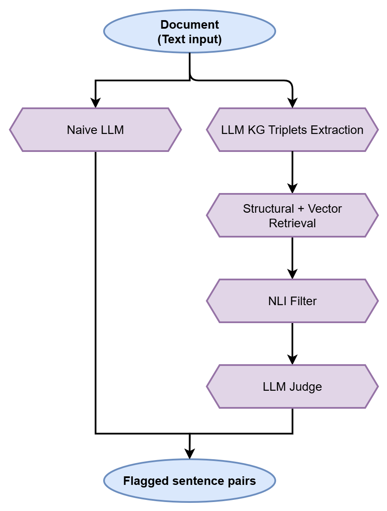

## Architecture

### Ingestion (run once per document)

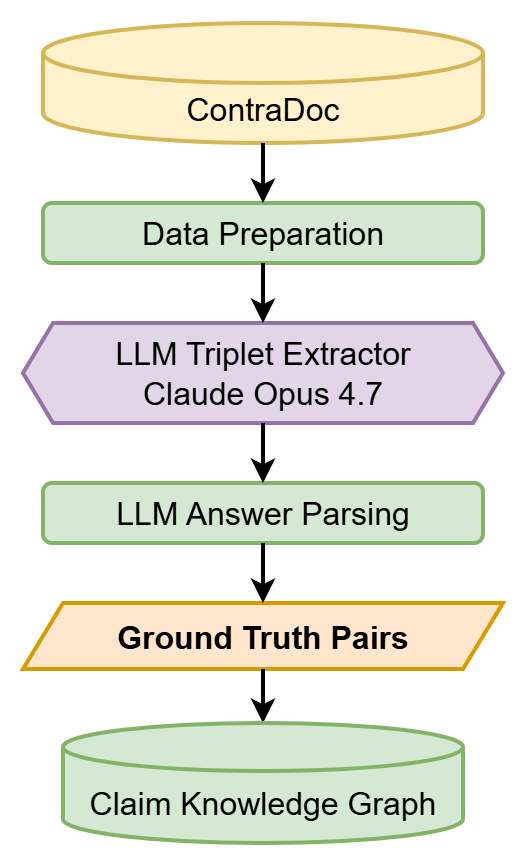

1. **Sentence segmentation + gold-pair flag attachment** — every ContraDoc document is split into sentence-level chunks; gold `(evidence, ref)` annotations are propagated as boolean flags on each chunk.
2. **MinIE-style triple extraction** with `claude-opus-4-7` — each sentence yields zero or more `Triple(subject, predicate, object)` records under a Pydantic schema with separate `polarity / polarity_marker / modality / attribution / quantity` fields. Predicates are stored in canonical affirmative-certain form so that negation contradictions are detectable through structural Cypher rather than requiring NLI surface-string awareness.
3. **Neo4j ingestion** under a chunk-first GraphRAG schema:
   - `(:Document)-[:CONTAINS]->(:Chunk)-[:MENTIONS]->(:Entity)`
   - `(:Entity)-[:RELATION {predicate, polarity, modality, attribution, quantity, doc_id, sentence_id}]->(:Entity)`
   - `:Entity` is scoped by `(doc_id, name)`, partitioning the graph into 150 disjoint per-document subgraphs.
   - `:Chunk` carries a 384-dim SBERT (`all-MiniLM-L6-v2`) embedding; a Neo4j vector index supports cosine retrieval.

### Inference (run per query)

Two retrieval channels run in parallel against the KG, their union is filtered by NLI, and survivors are judged by an LLM:

- **Structural** — three Cypher patterns over `:RELATION` edges, aggregated to chunk pairs via `sentence_id`:
  - **S-SR**: same subject + same predicate, different object (or different polarity tag) → captures numeric / factual swaps.
  - **S-SO**: same subject + same object, different predicate → captures stance / negation reversals.
  - **S-Union**: deduplicated union of the two.
- **Vector** — for each document with $n$ chunks, all $\binom{n}{2}$ intra-document pairs are scored by cosine on the SBERT embeddings; top-$K{=}20$ pairs are kept. Strictly intra-document; no cross-document pairs are ever scored.
- **NLI filter** — `cross-encoder/nli-deberta-v3-base` with the 3-class head replaced by a 2-class contradiction-vs-not head and fine-tuned on a leakage-controlled ContraDoc-derived split (90 / 23 / 103 positives + 444 / 104 / 564 negatives in train / val / test). Cascade operating point is `prob ≥ 0.5`.
- **LLM judge** — `claude-sonnet-4-6` (primary) or `claude-haiku-4-5` (cheap variant) over the ContraDoc 8-type taxonomy with structured Pydantic output.

### Ablation grid

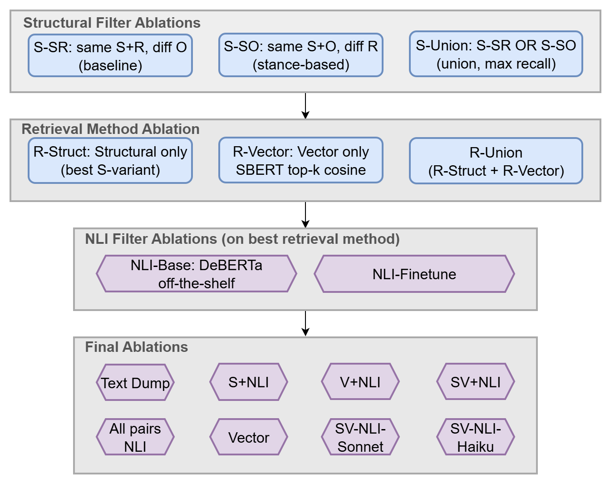

Four factors are varied: structural pattern (S-SR / S-SO / S-Union), retrieval method (R-Struct / R-Vector / R-Union), NLI head (NLI-Base / NLI-FT), LLM judge (Sonnet / Haiku / off). Eight end-to-end paths are reported in the master table further down.

## Dataset

- **ContraDoc** (Li et al., 2024): 891 long documents (Wikipedia, narrative fiction, news), each labeled YES with annotated `(evidence, ref)` sentence pairs and an 8-type contradiction label, or NO.
- **Working benchmark**: deterministic 150-document subset (118 YES, 32 NO), 5,651 sentence-chunks, 122 cross-chunk gold contradiction pairs across 118 documents. Same-sentence gold pairs are excluded by construction (no cross-chunk retriever can return same-chunk pairs).

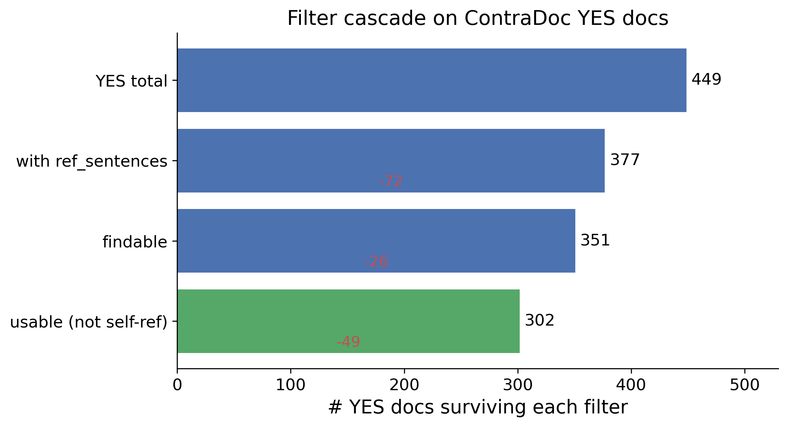
*Filter cascade from raw ContraDoc to the 150-doc benchmark — strips self-referencing, unfindable, and ref-less docs before balanced sampling over the 8-type taxonomy.*

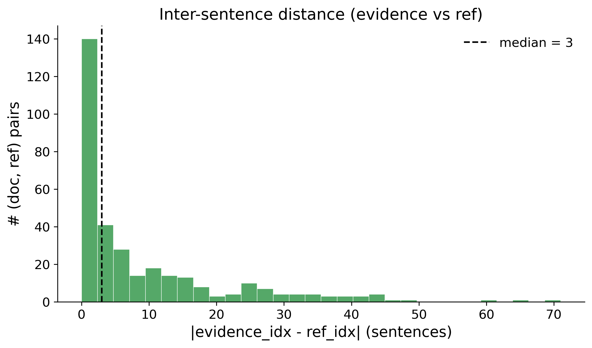
*Inter-sentence distance between gold evidence and reference within the same YES document. The right tail (10+ sentences) is what makes a retrieval stage non-optional — a sliding-window NLI baseline cannot see across this gap.*

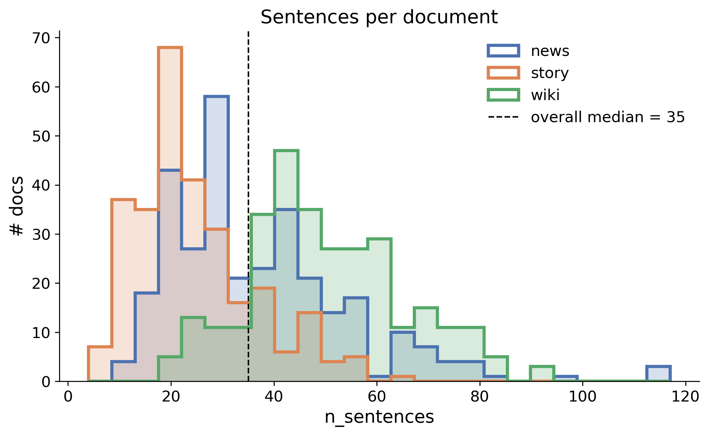
*Document length in sentences. Most documents fit comfortably in a modern LLM context window, which is why the text-dump baseline is even competitive at this benchmark size.*

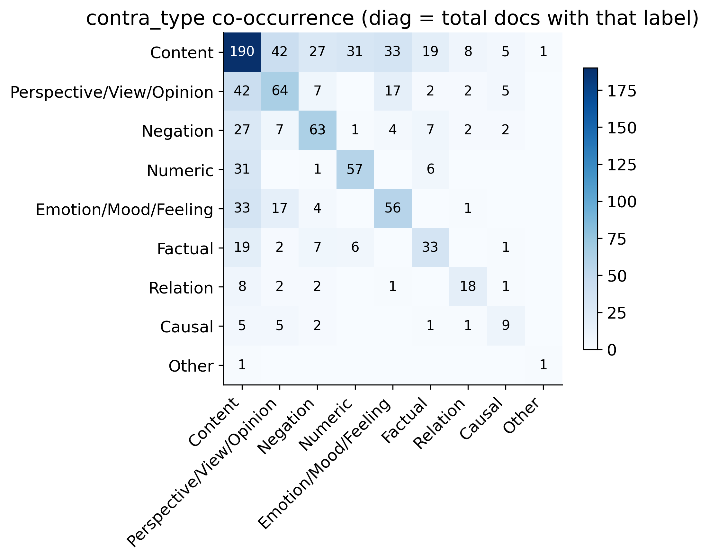
*Multi-label contradiction-type co-occurrence: a single document can carry e.g. `Content|Numeric|Factual`. Diagonal = total docs with that label; off-diagonal = co-occurrence count.*

## Triple extraction and knowledge graph

`claude-opus-4-7` extracts MinIE-style triples from each of 5,651 sentences across the 150 documents, yielding 9,189 triples in ~2 hours of wall time at $23.82 in LLM cost.

| Metric | Value |
|---|---:|
| Documents | 150 |
| Sentences (chunks) | 5,651 |
| Triples extracted | 9,189 |
| Entities (doc-scoped) | 11,503 |
| `:MENTIONS` edges | 15,676 |
| `:RELATION` edges | 9,189 |
| Mean triples / document | 61.3 |
| Mean token overlap (grounding heuristic) | 88.1% |
| Triples passing 0.8 grounding | 76.7% |
| Total extraction cost (Opus) | $23.82 |

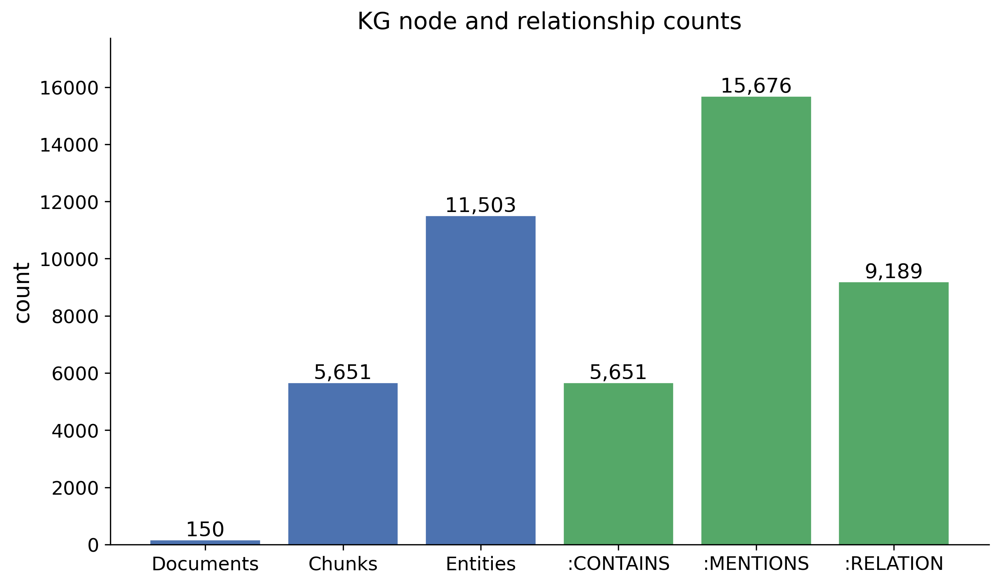
*Node and relationship counts in the populated Neo4j knowledge graph. Blue = node counts, green = relationship-edge counts.*

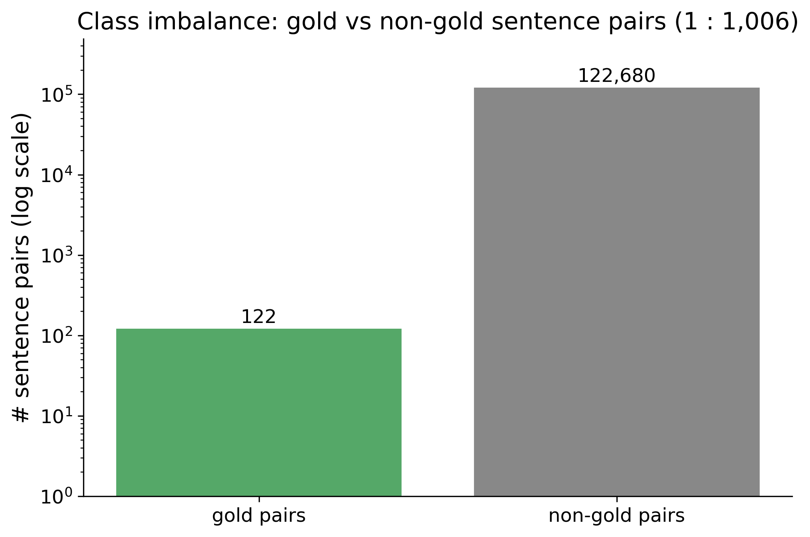
*1 : 1,006 class imbalance: 122 gold contradiction pairs hide among 122,802 intra-document candidate sentence pairs. The single strongest quantitative argument for an upstream retrieval stage.*

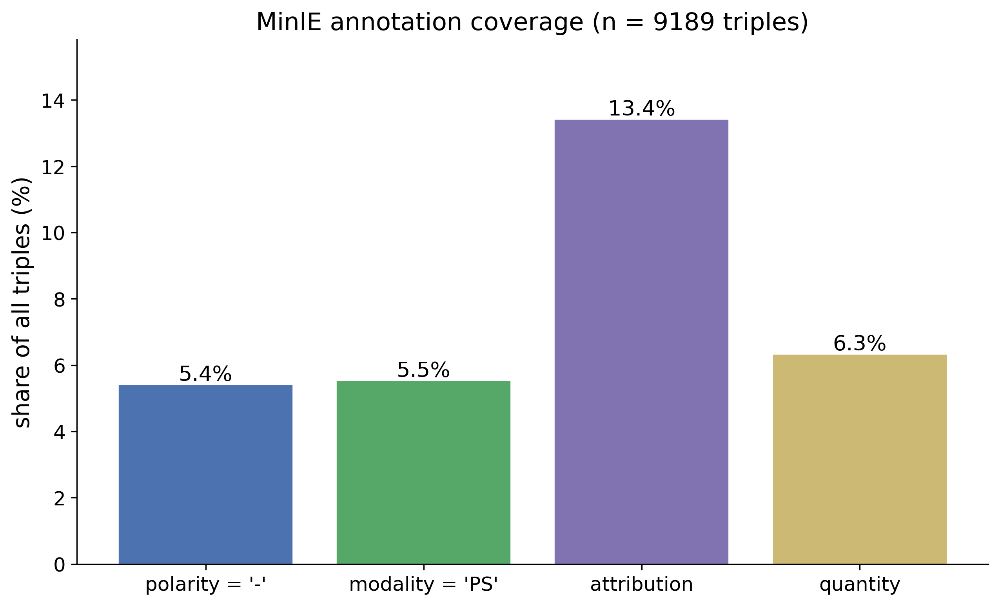
*MinIE-style annotation coverage across the 9,189 extracted triples: polarity = `-` on 5.4%, modality = `PS` on 5.5%, attribution on 13.4%, quantity on 6.3%. Low enough that a string-only predicate match would miss negation contradictions; high enough that explicit MinIE-aware Cypher disjuncts pay off.*

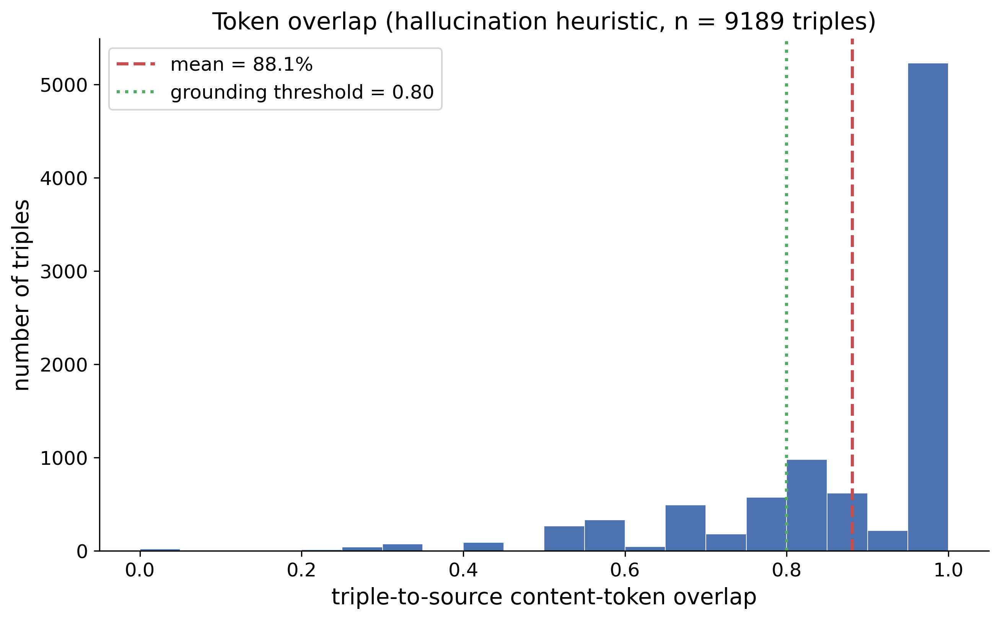
*Triple-to-source token overlap, the hallucination heuristic. Mean 88.1%; 76.7% of triples meet a 0.8 grounding threshold.*

## NLI fine-tuning data

Notebook [`06_NLI_data_ContraDoc`](experiments/06_NLI_data_ContraDoc.ipynb) builds train / val / test splits under a two-tier leakage discipline: strict disjointness on `doc_id` (no eval doc leaks into training) and soft disjointness on `base_doc_id` (negation-injection variants of the same source are not split across train and test).

| Split | Positives | Negatives | Total |
|---|---:|---:|---:|
| train | 90 | 444 | 534 |
| val   | 23 | 104 | 127 |
| test  | 103 | 564 | 667 |

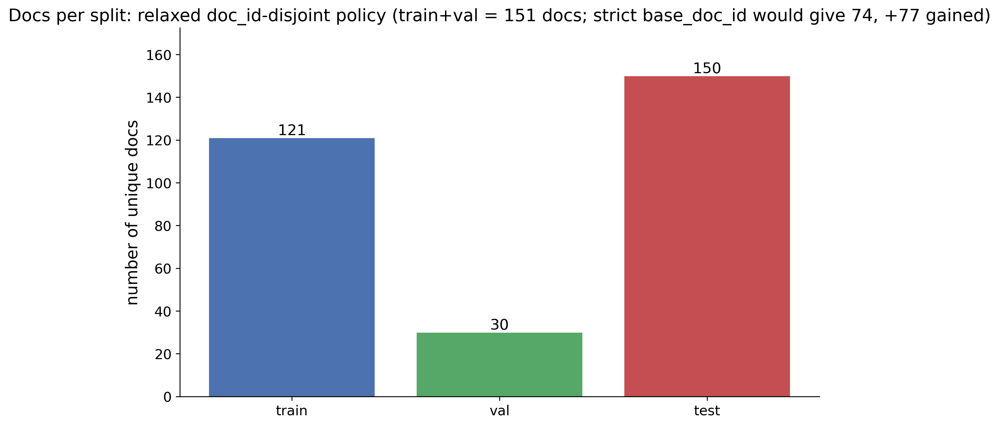
*Documents available per split under the relaxed `doc_id`-disjoint policy. Train+val pool admits 151 docs; strict `base_doc_id` disjointness would shrink that to 74. Test = the 150-doc balanced eval set.*

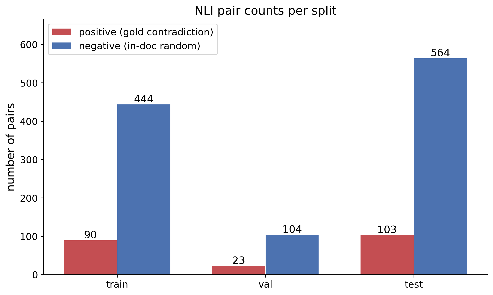
*NLI fine-tune pair counts. Negatives are 4 random in-document non-gold sentence pairs per positive (NEG_PER_POS = 4) with premise/hypothesis order randomized.*

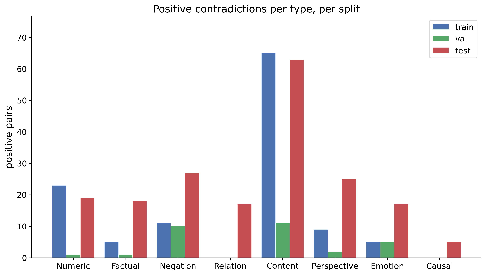
*Positive contradictions per ContraDoc type, per split. `Content` dominates as in the underlying benchmark; `Causal` (n = 4 in test) is the long tail.*

## Results

### RQ1 — Structural filter

Which Cypher pattern surfaces the most gold pairs? **S-Union strictly dominates** S-SR and S-SO on pair-recall and doc-recall while staying at the same precision floor. The two component patterns are nearly orthogonal at the contradiction-type level.

| Variant | Candidates | Caught gold | Pair-recall | Doc-recall | Precision |
|---|---:|---:|---:|---:|---:|
| S-SR     | 478 | 29 | 23.8% | 24.6% | 6.1% |
| S-SO     | 415 | 27 | 22.1% | 22.0% | 6.5% |
| **S-Union** | **878** | **55** | **45.1%** | **46.6%** | 6.3% |

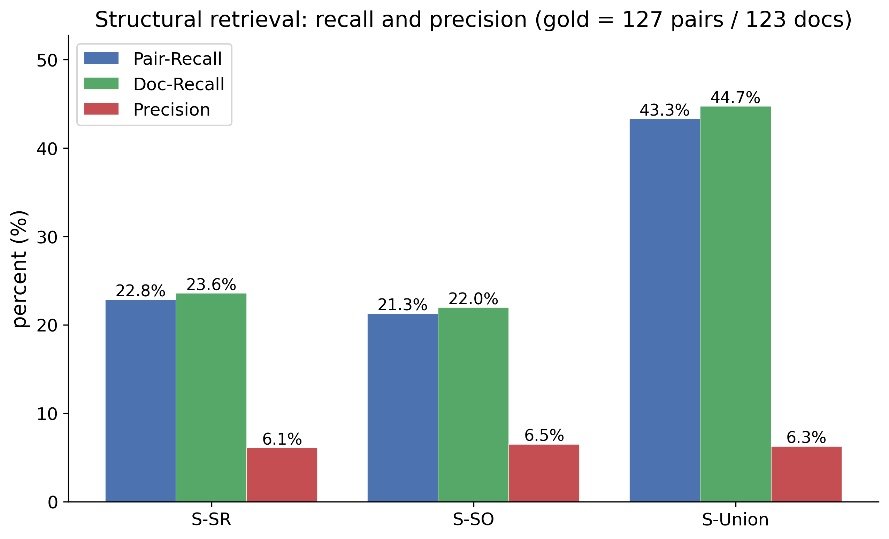
*Structural retrieval recall and precision against the 122 cross-chunk gold pairs (118 documents).*

Per-type recall by structural pattern (denominators sum to more than 122 because each gold pair carries one or more `contra_type` tags):

| Type (n) | S-SR | S-SO | S-Union |
|---|---:|---:|---:|
| Numeric (20)    | **70.0%** |  5.0% | 70.0% |
| Factual (19)    | **47.4%** | 15.8% | 63.2% |
| Negation (32)   |  3.1% | **40.6%** | 43.8% |
| Relation (15)   |  6.7% | **33.3%** | 40.0% |
| Content (74)    | **24.3%** | 14.9% | 37.8% |
| Perspective (37)| 13.5% | **18.9%** | 32.4% |
| Emotion (31)    |  6.5% | **19.4%** | 25.8% |
| Causal (7)      |  0%   |  0%   |  0%   |

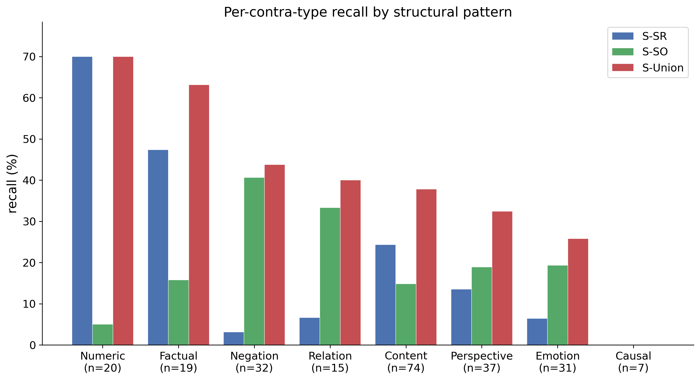
*S-SR catches Numeric / Factual swaps (same subject + predicate, different object); S-SO catches Negation / Relation / Perspective / Emotion flips (same subject + object, different predicate). Causal is below the structural floor for both — its contradictions are typically two-sentence cause/effect pairs that share no triple-level overlap.*

**Decision**: adopt S-Union as the structural channel.

### RQ2 — Retrieval method combination

Does combining structural with intra-document top-$K$ vector retrieval improve gold-pair coverage? **Yes**. Vector dominates structural at every $K \geq 5$ and on every contradiction type, but the union still adds a ~5-point pair-recall lift across all $K$ values at the cost of the upstream extraction.

| K | Vector pair-recall | Vector + S-Union pair-recall | Vector doc-recall | Vector + S-Union doc-recall |
|---:|---:|---:|---:|---:|
|  1 | 30.3% | 48.4% | 31.4% | 50.0% |
|  3 | 40.2% | 51.6% | 41.5% | 53.4% |
|  5 | 45.1% | 54.9% | 46.6% | 56.8% |
| 10 | 52.5% | 58.2% | 54.2% | 60.2% |
| **20** | **57.4%** | **62.3%** | **58.5%** | **63.6%** |

(For reference: S-Union alone is 45.1% pair-recall — vector alone matches it at K ≈ 5.)

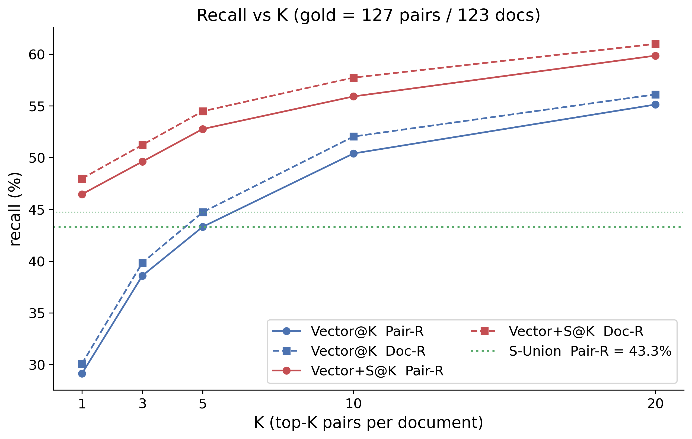
*Pair-recall (solid) and doc-recall (dashed) against the 122 cross-chunk gold pairs as $K$ varies. The S-Union baseline (green dotted) is reached by vector alone at $K \approx 5$.*

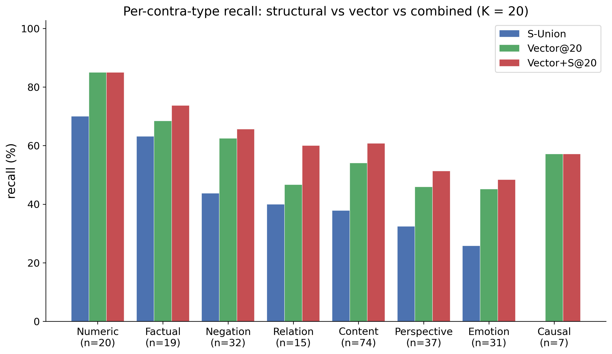
*Per-type recall at $K = 20$: structural (S-Union), vector alone, and the combined pool. Vector strictly dominates S-Union on every type; the combined pool adds the largest absolute lift on Relation (+13 pp), Content (+7 pp), and Factual (+6 pp) over vector alone.*

**Decision**: adopt Vector + Structural at $K = 20$ as the cascade's retrieval pool (76 / 122 = 62.3% pair-recall, 75 / 118 = 63.6% doc-recall).

### RQ3 — NLI fine-tuning

Does in-domain binary fine-tuning beat the off-the-shelf 3-class NLI head as a candidate filter? **Yes, by a wide margin**. NLI-Base never reaches a meaningful operating point on the candidate pool; NLI-FT does.

| Head | Best threshold | Best F1 | Pair-recall at best F1 |
|---|---:|---:|---:|
| NLI-Base (off-the-shelf, 3-class softmax) | 0.998 | 19.4% | high (promiscuous) |
| **NLI-FT (binary fine-tuned)**            | **0.941** | **60.1%** | ~60% |

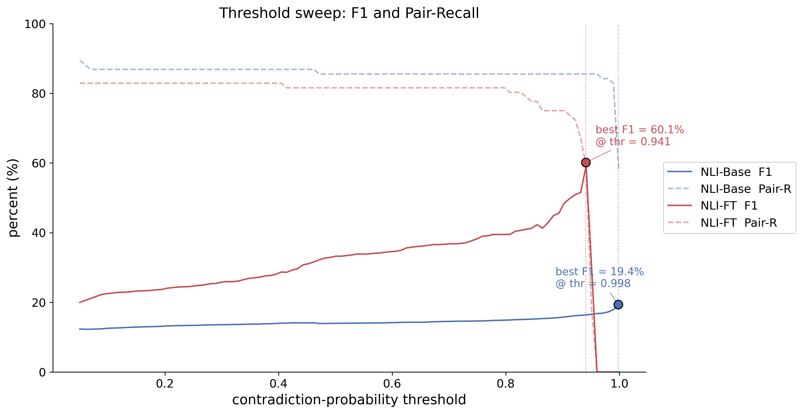
*Threshold sweep on the candidate pool. F1 (solid) and pair-recall (dashed) for NLI-Base and NLI-FT. NLI-FT peaks at F1 = 60.1% (thr. 0.941); NLI-Base only reaches 19.4% at thr. 0.998.*

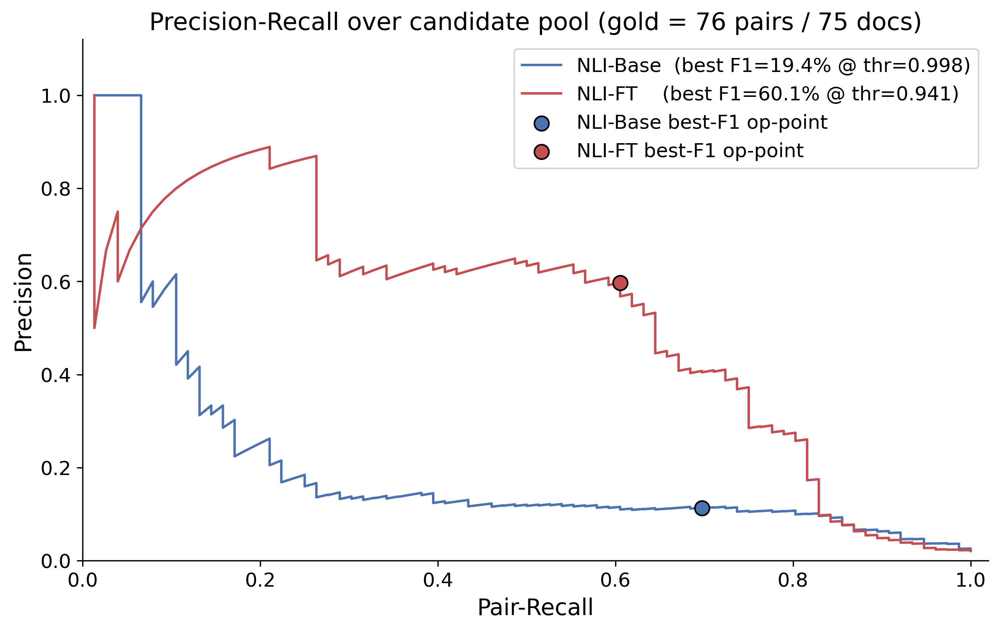
*Precision-recall over the candidate pool. NLI-FT strictly dominates NLI-Base; best-F1 operating points are marked. NLI-FT achieves 60% precision at 60% recall where NLI-Base is at ~10%.*

**Retrieval × NLI grid**. Fine-tuning lifts every retrieval pool by 30–50 absolute F1 points; on top of that, a structural pre-filter lifts the NLI-FT operating point further (because Cypher-filtered pairs are pre-enriched with subject/object overlap, exactly the signal NLI-FT learned to score).

| Retrieval pool | NLI-Base best-F1 | NLI-FT best-F1 |
|---|---:|---:|
| All-pairs               |  1.3 | 34.1 |
| Structural-only ("KG only") | 36.9 | **75.8** |
| Vector-only             | 22.3 | 62.7 |
| Vector + Structural     | 19.4 | 60.1 |

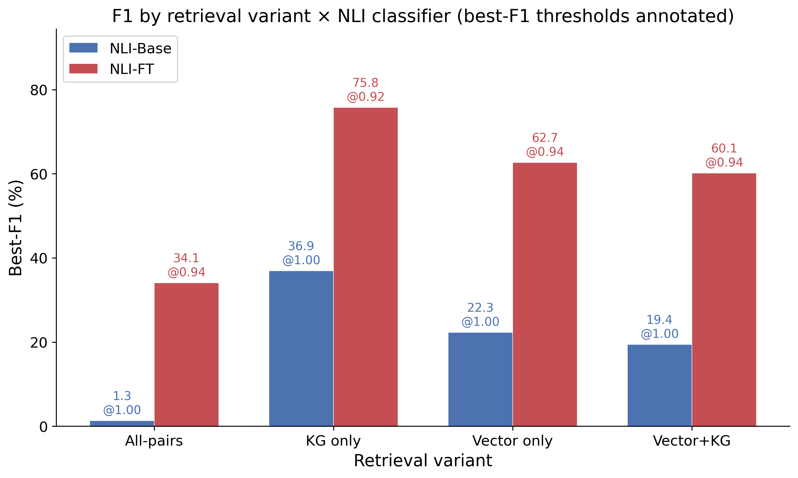
*Best-F1 of each NLI head on each retrieval pool, with the chosen threshold annotated.*

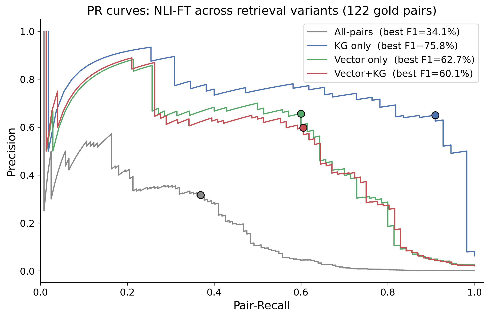
*NLI-FT PR curves over each retrieval pool (122 gold pairs). Structural-only dominates because its candidates are pre-enriched with structural overlap; All-pairs is recall-bounded by NLI alone.*

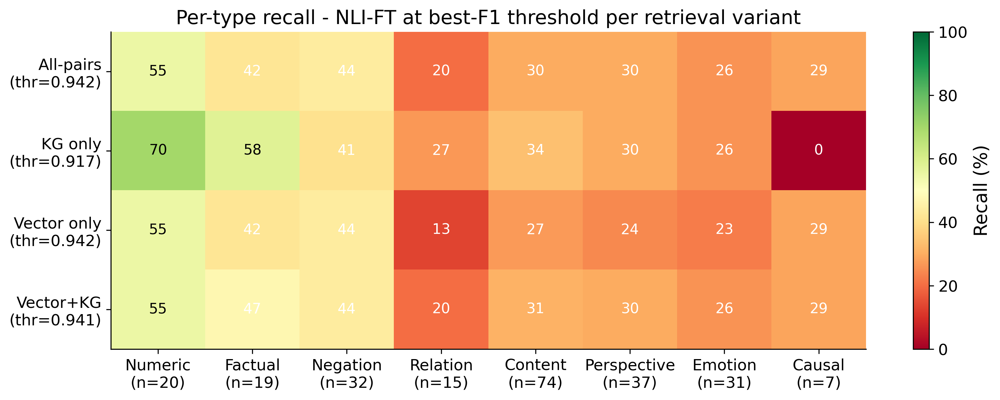
*Per-type recall of NLI-FT at each retrieval variant's best-F1 threshold. Structural-only's high overall F1 hides a complete miss on Causal (n = 7); Vector-based pools cover every type at moderate recall.*

**Decision**: cascade uses Vector + Structural feeding NLI-FT at the lower threshold of 0.5 (rather than the standalone-best 0.94) so that the LLM judge downstream still sees enough recall to operate on.

### RQ4 — Cascade vs text-dump baseline

Does the full cascade (Vec + Struct → NLI-FT@0.5 → Sonnet judge) beat a direct text-dump LLM baseline on F1, and how do per-document cost and latency compare?

**Master ablation** on 150 documents / 122 cross-chunk gold pairs. Costs and times are per-document averages, including ingestion-time extraction for any configuration that uses the structural channel. Anthropic 2026 pricing: Opus $15/$75, Sonnet $3/$15, Haiku $0.80/$4 per million in/out tokens.

| Configuration | TP | FP | FN | P | R | F1 | $/doc | s/doc |
|---|---:|---:|---:|---:|---:|---:|---:|---:|
| Text-dump (Sonnet)                          | 87 | 252 | 35 | 25.7% | **71.3%** | 37.7%        | 0.012  | 6.7 |
| All-pairs → NLI-FT @ 0.94                   | 45 |  97 | 77 | 31.7% | 36.9%     | 34.1%        | 0.000  | 3.0 |
| Vector → NLI-FT @ 0.94                      | 42 |  22 | 80 | 65.6% | 34.4%     | 45.2%        | 0.000  | **0.16** |
| Structural → NLI-FT @ 0.92                  | 50 |  27 | 72 | 64.9% | 41.0%     | **50.3%**    | 0.159  | 48.1 |
| Vector + Structural → NLI-FT @ 0.94         | 46 |  31 | 76 | 59.7% | 37.7%     | 46.2%        | 0.159  | 48.2 |
| Vector → LLM (Sonnet)                       | 66 | 498 | 56 | 11.7% | 54.1%     | 19.2%        | 0.117  | 65.4 |
| Vec+Struct → NLI@0.5 → LLM (Sonnet)         | 62 | 109 | 60 | 36.3% | 50.8%     | 42.3%        | 0.170  | 54.3 |
| Vec+Struct → NLI@0.5 → LLM (Haiku)          | 60 | 125 | 62 | 32.4% | 49.2%     | 39.1%        | 0.162  | 51.6 |

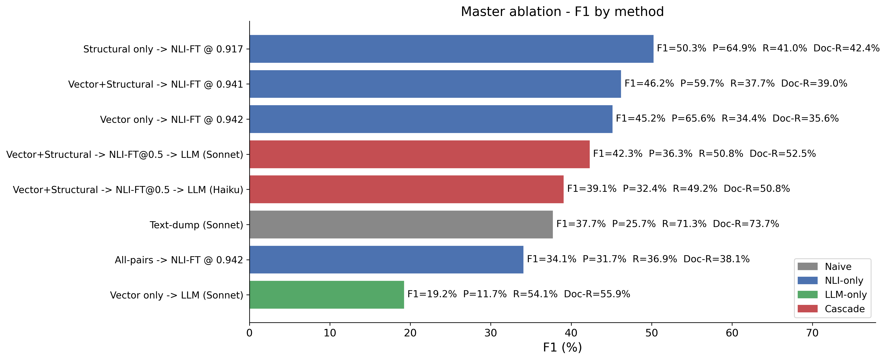
*F1 ordering across the eight configurations. NLI-only (blue) dominates the F1 axis; the cost of adding an LLM judge on top is visible only in the cascade rows (red).*

**Headline (RQ4)**: cascade F1 = 42.3% vs text-dump F1 = 37.7% (+4.6 absolute points), at ~14× the cost and ~8× the latency. Cascade buys precision (36.3% vs 25.7%); the baseline retains a recall edge (71.3% vs 50.8%) because dumping the full document gives the LLM maximum context per call. The Haiku judge variant is a 3.2-point F1 drop in exchange for a marginal cost reduction — the judge model is not the bottleneck.

#### Cost / time / quality trade-offs

The Pareto plots reframe the master ablation as a trade-off rather than a ranking. NLI-only configurations sit on the efficient frontier; cascade configurations sit *off* the cost frontier — they pay both the extraction cost and the LLM judge cost but do not improve F1 over Structural → NLI-FT alone.

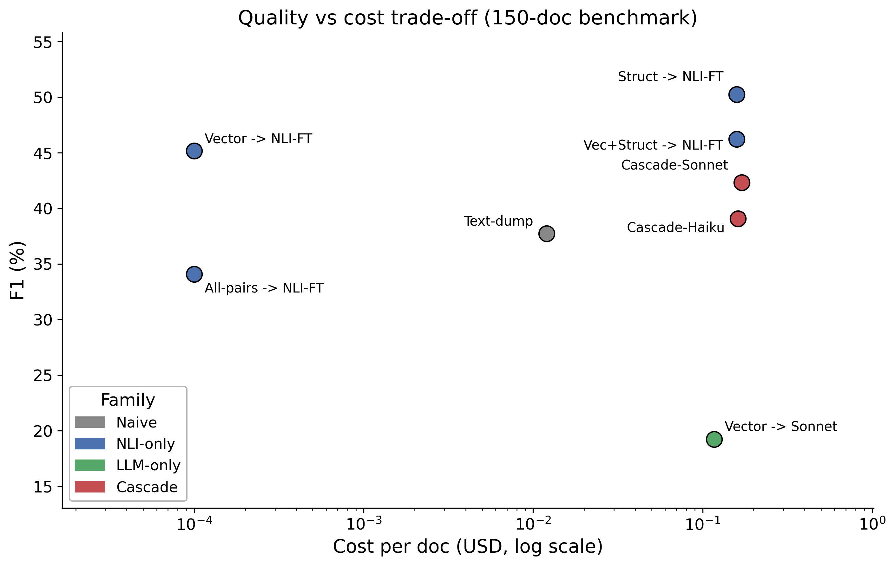 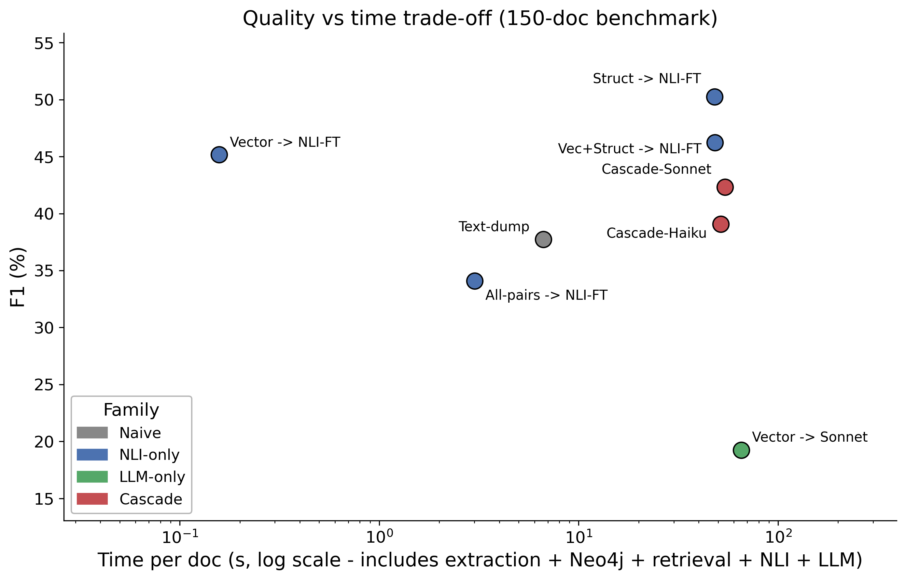

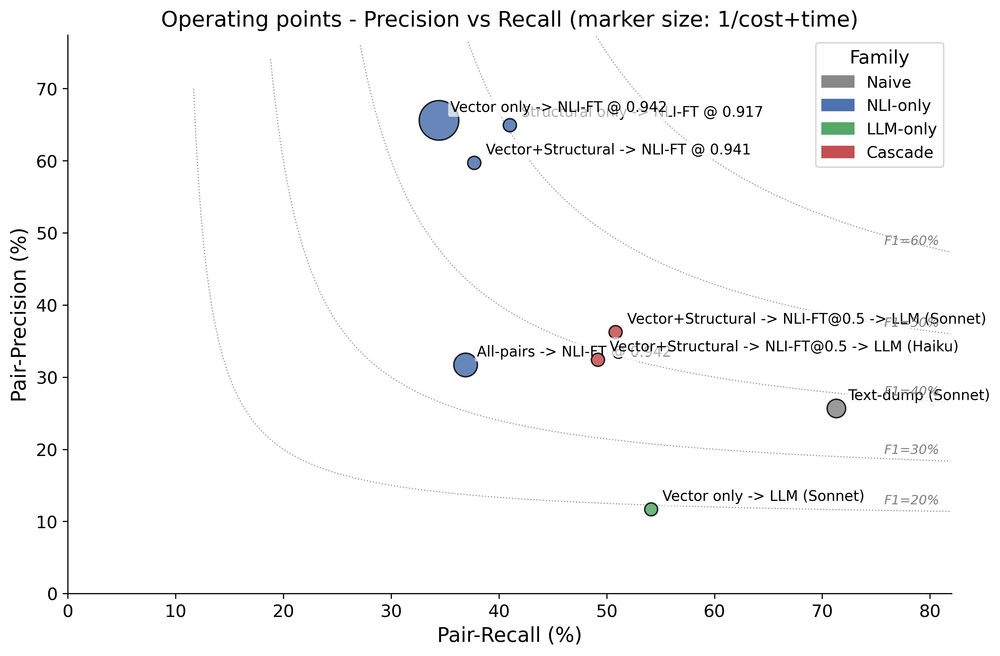
*Per-configuration operating points; marker size $\propto 1 / (\text{cost} + \text{time})$. NLI-only configurations occupy the high-precision / moderate-recall corner; cascades trade ~25 precision points for ~15 recall points at higher cost.*

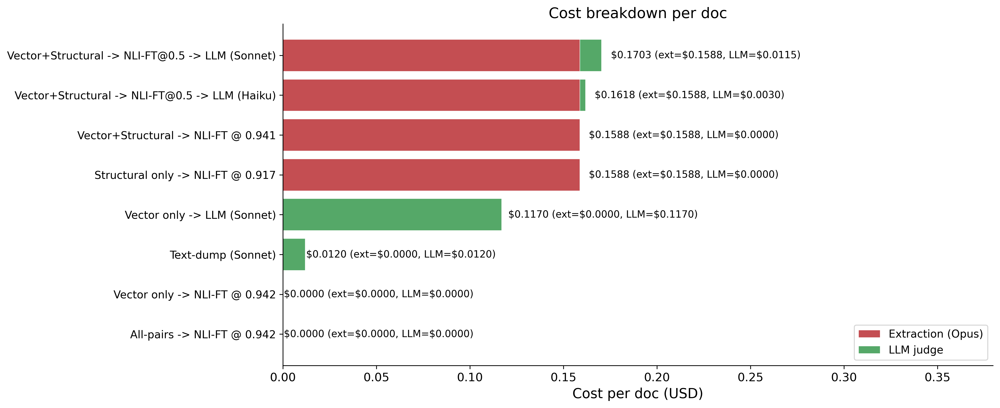
*Per-document cost decomposition. Extraction (Opus, red) dominates every configuration that uses the structural channel; the LLM judge (green) adds only $0.012 (Sonnet) or $0.003 (Haiku) on top.*

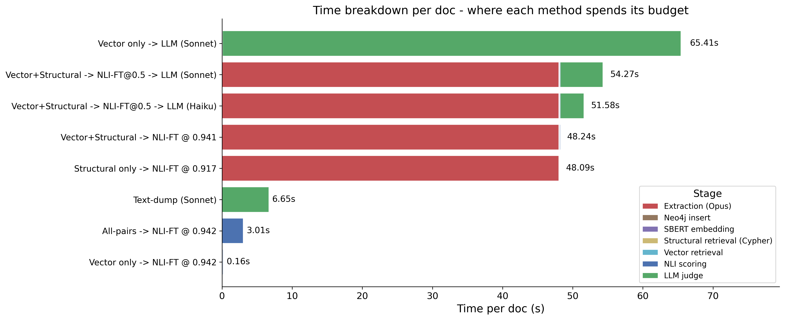
*Per-document time decomposition. Extraction is the binding latency in every structural configuration; cascade and NLI-only variants differ by less than 7 seconds end-to-end once extraction is paid.*

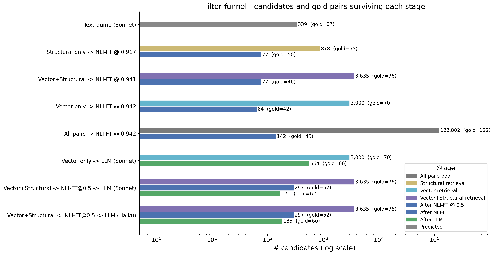
*Candidate volume at each stage of every configuration (log scale). Vec+Struct collapses 3,635 candidates → 297 NLI-survivors → 171 (Sonnet) or 185 (Haiku) flagged predictions, a 21× overall reduction.*

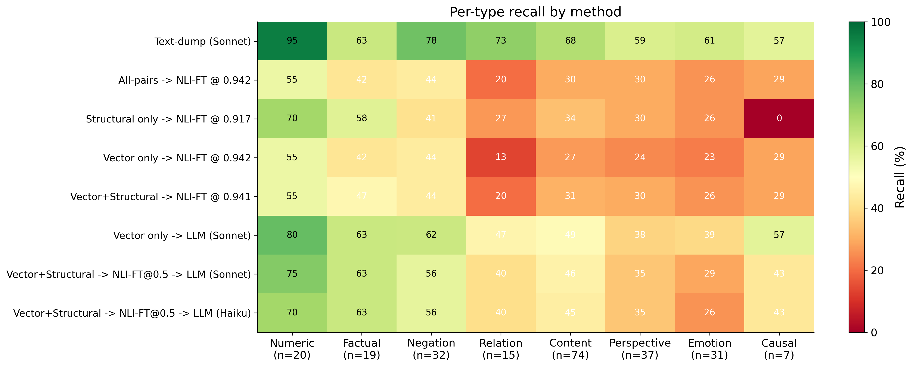
*Per-contradiction-type recall across all 8 configurations. Text-dump dominates on every type; the cascade is most competitive on Numeric / Factual / Negation (the relation- and predicate-driven types the structural channel was designed for) and weakest on emotion- and content-driven types.*

## Error analysis

We focus on the cascade configuration (Vec+Struct → NLI@0.5 → Sonnet) — full analysis in [`09_error_analysis_ContraDoc`](experiments/09_error_analysis_ContraDoc.ipynb).

**Stage attribution** — of 122 gold pairs:

| Stage where gold dies | Count | % |
|---|---:|---:|
| `retrieval_miss` | 46 | 37.7% |
| `nli_miss`       | 14 | 11.5% |
| `llm_reject`     |  0 |  0.0% |
| `caught` (TP)    | 62 | 50.8% |

The LLM judge never rejected a gold pair that made it through NLI on this benchmark. Detection loss is entirely upstream — ~3× more loss at retrieval than at NLI. Improvements in retrieval coverage have higher leverage than any downstream change.

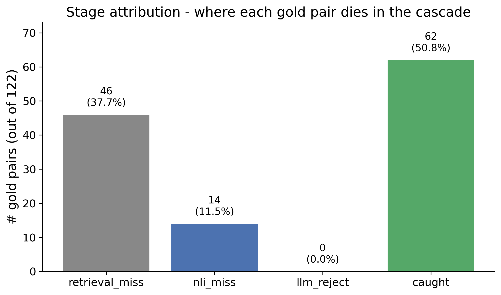

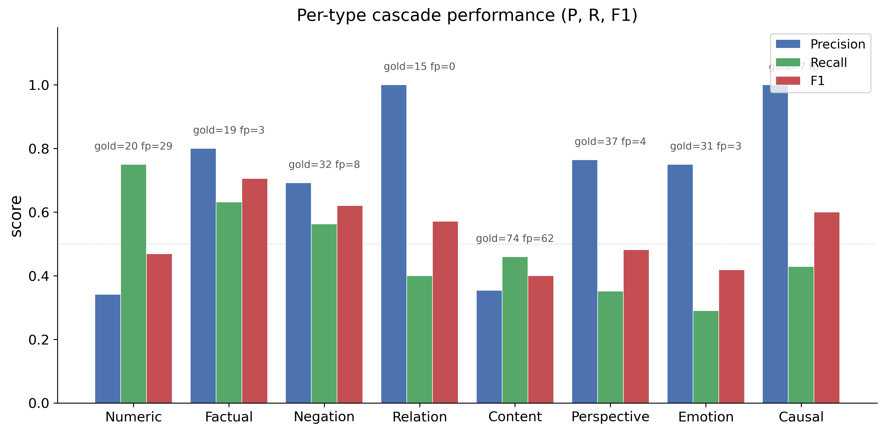
*Per-contradiction-type precision, recall, and F1 of the cascade. Numeric has the worst precision-recall imbalance (34% / 75%); Relation and Causal are precision-perfect (100%) but small-$n$.*

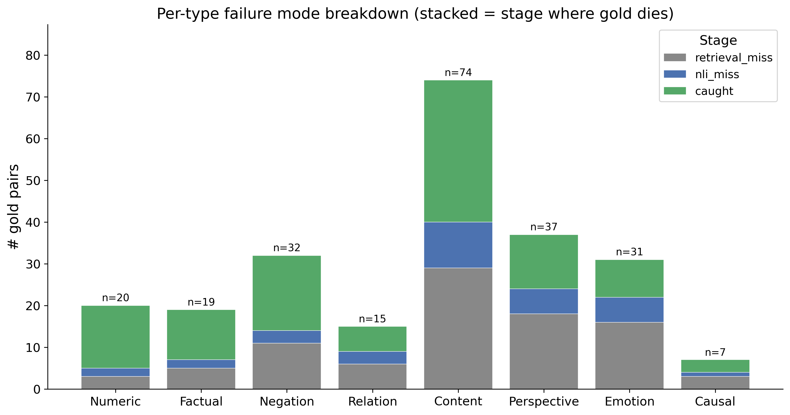
*Per-type failure mode: stacked bars decompose each type's gold pairs into retrieval-miss (gray), NLI-miss (blue), and caught (green). Content carries the largest absolute retrieval loss; Numeric and Factual are predominantly caught.*

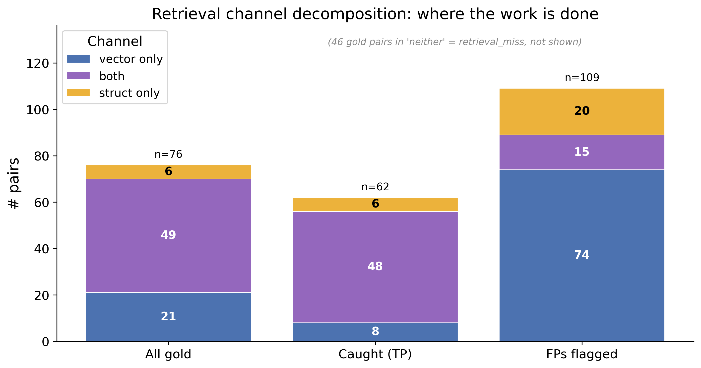
*Decomposition of retrieval credit. Of 76 gold pairs that survive retrieval, 49 are reachable through both channels and only 6 through structural alone, but structural adds far fewer false positives per gold pair than vector (20 : 6 ≈ 3.3 vs 74 : 8 ≈ 9.3). Vector is the noisier channel by an order of magnitude.*

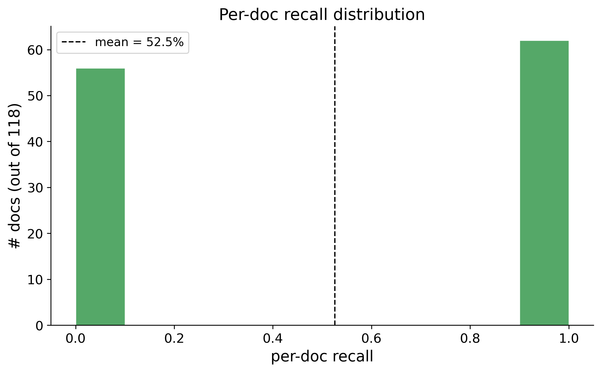
*Per-document recall is bimodal: 56 docs missed entirely (recall = 0), 62 fully caught (recall = 1), zero docs in the partial-recall middle. The fix is not deeper top-$K$ within already-retrieved documents — it is pulling more documents into the retrievable set.*

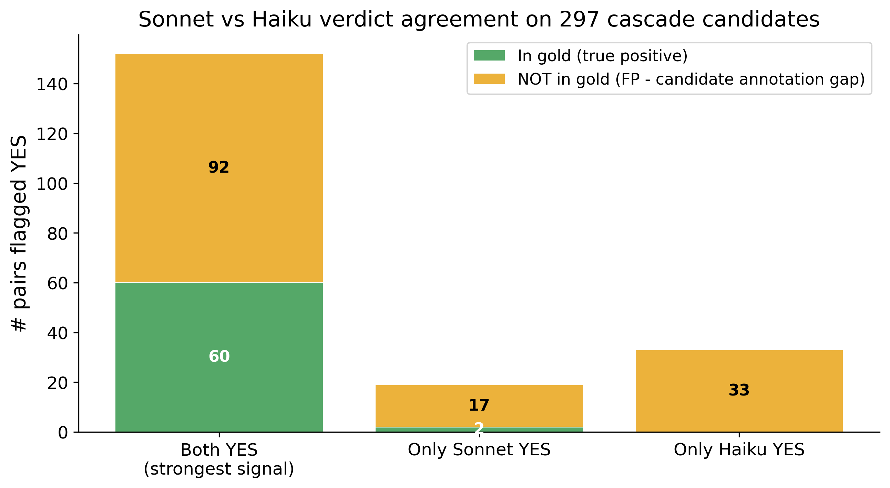
*Sonnet vs Haiku on the same 297 cascade candidates. Agreement = 245 / 297 = 82.5%. The most informative cell is **both judges flag, not in gold = 92** — pairs the dataset never labeled but two independent LLM judges agree are contradictions.*

**Inter-judge triangulation**. Strict precision for the cascade is 36.3% (62 / 171 Sonnet-yes); if the 92 both-yes-not-gold pairs are accepted as truly correct, upper-bound effective precision is **90.1%** ((62 + 92) / 171). The benchmark systematically under-annotates: each YES document carries a single *injected* gold pair, leaving any pre-existing internal contradictions in the source unlabeled. A formal manual adjudication of the 92 candidates would refine the lower bound.

## Tech stack

| Component | Technology |
|---|---|
| Knowledge graph | Neo4j 5 (Docker) + APOC + native vector index |
| Triple extraction | `claude-opus-4-7` via `langchain-anthropic` structured output (Pydantic) |
| Sentence embeddings | `sentence-transformers/all-MiniLM-L6-v2` (384-dim, cosine) |
| NLI head | `cross-encoder/nli-deberta-v3-base`, binary 2-class fine-tuned (AdamW, LR 2e-5, batch 8, 3 epochs, max-len 256, seed 42) |
| LLM judge | `claude-sonnet-4-6` (primary) / `claude-haiku-4-5` (cheap variant) |
| Config | `pydantic-settings` + `.env` |
| Logging | `loguru` |
| Package manager | `uv` |
| Web app | FastAPI backend + Svelte 5 frontend (Docker Compose) |

## Repository layout

```
.
├── README.md
├── assets/                          # Top-level pipeline diagrams
├── app/                             # Web demo (FastAPI + Svelte)
│   ├── backend/
│   ├── frontend/
│   └── docker-compose.yml
└── experiments/                     # All notebooks (one stage per notebook)
    ├── 00_load_ContraDoc.ipynb
    ├── 01_EDA_ContraDoc.ipynb
    ├── 02_triples_extraction_ContraDoc.ipynb           # legacy (3-class predicate)
    ├── 02b_triples_extraction_minie_style.ipynb        # MinIE-style extraction (current)
    ├── 03_insert_to_neo4j_ContraDoc.ipynb
    ├── 04_structural_filtering_ContraDoc.ipynb         # RQ1
    ├── 05_vector_similarity_ContraDoc.ipynb            # RQ2
    ├── 06_NLI_data_ContraDoc.ipynb                     # leakage-controlled splits
    ├── 06_NLI_finetune_ContraDoc.ipynb                 # binary head fine-tune
    ├── 06_NLI_ContraDoc.ipynb                          # NLI-Base vs NLI-FT scoring
    ├── 07_NLI_ablation_ContraDoc.ipynb                 # retrieval × classifier sweep
    ├── 08_LLM_ablation_ContraDoc.ipynb                 # master ablation (RQ4)
    ├── 09_error_analysis_ContraDoc.ipynb               # stage attribution + per-type
    ├── config.py                                       # pydantic-settings
    ├── plots/                                          # per-notebook plot outputs
    └── data/
        ├── raw/ContraDoc/
        └── processed/ContraDoc/
```

## Web demo

The cascade and the text-dump baseline are exposed through a browser-based demo (FastAPI backend + Svelte 5 frontend, all in `app/`). The same input can be toggled between **Naive LLM** and **KG Cascade** modes; the cascade exposes per-stage telemetry so the user can inspect what survived each filter.

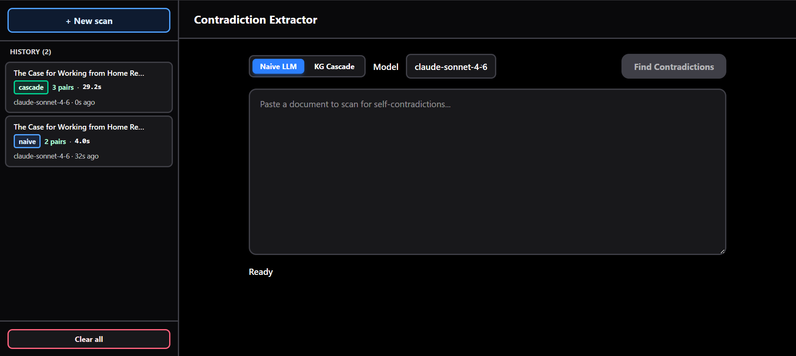
*Empty state. Left rail tracks past runs; the top bar selects mode (Naive LLM vs KG Cascade) and judge model; the document is pasted into the central textarea. The history shows the same "Case for Working from Home" article scanned in both modes — naive returns 2 pairs in 4.0 s; cascade returns 3 pairs in 29.2 s.*

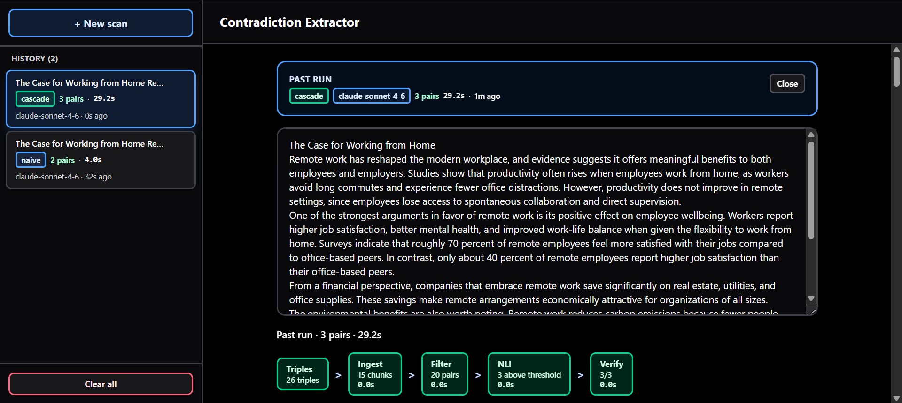
*Cascade run header. Per-stage telemetry across the bottom: 26 triples extracted → 15 chunks ingested → 20 candidate pairs surfaced → 3 surviving the NLI filter → all 3 confirmed by the verifier (29.2 s end-to-end).*

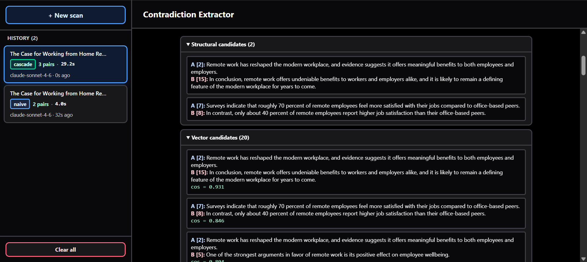
*Candidate retrieval, broken down by channel. **Structural** candidates come from Cypher patterns over the per-document KG; **Vector** candidates come from intra-document SBERT top-$K$ retrieval, with cosine similarity shown alongside each pair.*

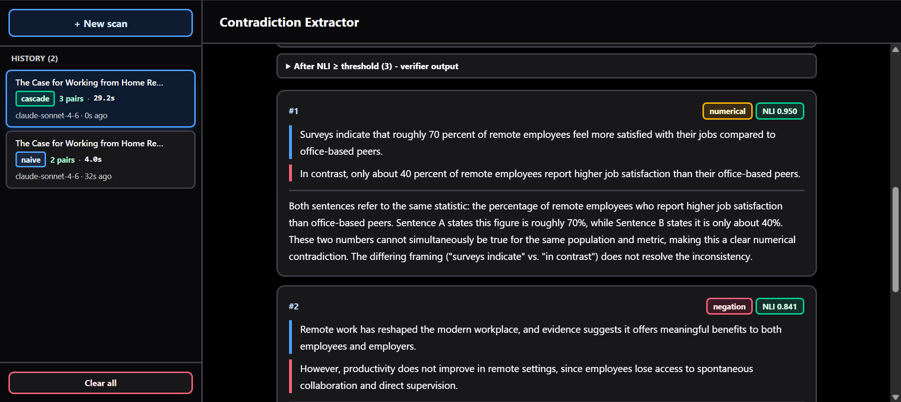
*Verifier output. Each surviving pair carries the contradiction type tag (e.g. `numerical`), its NLI score (e.g. 0.950), and the LLM judge's natural-language rationale. This pair flags the 70% / 40% remote-job-satisfaction discrepancy.*

The third pair the cascade flags on this document (a long-range `negation` between "meaningful benefits" early in the article and "productivity does not improve in remote settings" much later) is the kind of contradiction the text-dump baseline misses on this same input — a concrete instance of the cross-chunk advantage motivating the cascade architecture.

## Setup

Prerequisites: Docker + Docker Compose, [uv](https://docs.astral.sh/uv/), an Anthropic API key.

```bash
# 1. Clone
git clone https://github.com/Phyke/AT82.05-Claim-Contradiction-Over-Knowledge-Graphs.git
cd AT82.05-Claim-Contradiction-Over-Knowledge-Graphs

# 2. Configure environment (copy and fill)
cp experiments/.env.example experiments/.env  # ANTHROPIC_API_KEY, NEO4J_*, etc.

# 3. Start Neo4j
docker compose -f app/docker-compose.yml up -d neo4j

# 4. Install deps and run notebooks in order
cd experiments
uv sync
uv run --no-sync jupyter lab
```

Notebooks 00 → 09 are designed to run sequentially; each emits the inputs the next consumes (see `experiments/data/processed/ContraDoc/`).

To run the web demo locally:

```bash
cd app
docker compose up --build
# frontend: http://localhost:5173, backend: http://localhost:8000
```

## Limitations

Single-benchmark evaluation (ContraDoc, English, 150 documents); generalization to other domains, languages, and longer-document regimes is not claimed. NLI thresholds are picked per configuration on the same evaluation set with no held-out split, so reported F1 is optimistic. The 92 candidate annotation gaps surfaced by inter-judge agreement are a proxy, not a manual adjudication. Triple extraction uses a single LLM pass per document with no retry or self-consistency.

## Group members

- st125923 Prombot Cherdchoo
- st125981 Muhammad Fahad Waqar
- st125983 Nariman Tursaliev
- st126127 Takdanai Ruxthawonwong

Asian Institute of Technology — AT82.05

## References

Primary citations:

- Li, J., Raheja, V., & Kumar, D. (2024). *ContraDoc: Understanding self-contradictions in documents with large language models.* NAACL-HLT 2024. https://aclanthology.org/2024.naacl-long.362/
- de Marneffe, M.-C., Rafferty, A. N., & Manning, C. D. (2008). *Finding contradictions in text.* ACL-08:HLT. https://aclanthology.org/P08-1118/
- Gashteovski, K., Gemulla, R., & del Corro, L. (2017). *MinIE: Minimizing facts in open information extraction.* EMNLP 2017. https://aclanthology.org/D17-1278/
- He, P., Liu, X., Gao, J., & Chen, W. (2021). *DeBERTa: Decoding-enhanced BERT with disentangled attention.* ICLR 2021.
- Reimers, N., & Gurevych, I. (2019). *Sentence-BERT: Sentence embeddings using Siamese BERT-networks.* EMNLP-IJCNLP 2019. https://aclanthology.org/D19-1410/
- Manakul, P., Liusie, A., & Gales, M. J. F. (2023). *SelfCheckGPT: Zero-resource black-box hallucination detection for generative large language models.* EMNLP 2023.
